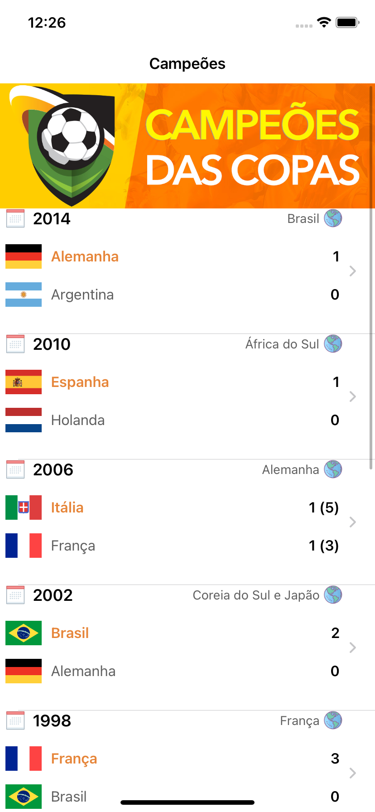
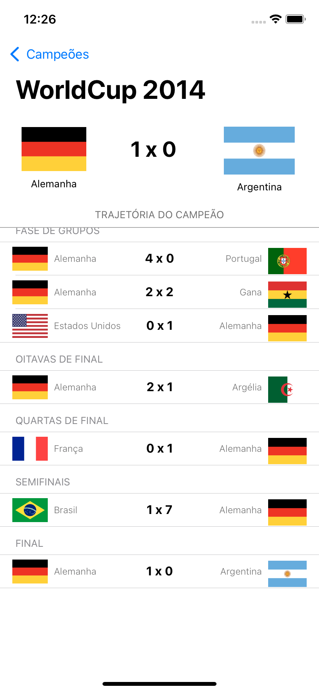

# CampeosDaCopa
> Aplicativo para desenvolvimento Swift/iOS

## Conceitos abordados

* Linguagem
    * Swift 5.5
    * MVC

* Auto Layout
    * Constraint
        * Content Compression Resistance Priority
        * Content Hugging Priority
    * Assets

* Components
    * UIView
    * UIImage
    * UILabel
    * UINavigationController
    * UITableViewController
    * UITableViewCell
    * Custom Cell
    * Segue

* Protocols
    * UITableViewDataSource
        * É responsável por dizer como a tabela será alimentada.
    * UITableViewDelegate

* JSON
* Header Table
* Sections Table
    * Grouped
        * Func titleForHeaderInSection

* Funções obrigatórias na implementação de uma TableView
    * func numberOfSection
        * Devolve quantas seções a tableView terá, se no caso for apenas uma (sem agrupamentos), você não precisa implementar esse metódo.
    * func numberOfRowsInSection
        * Devolve quantas linhas cada seção terá.
    * func cellForRowAt
        * É o método que efetivamente desenha na tela a célula. Sempre que a tableView for apresentar uma célula é esse método que constrói ela previamente para ficar rápido na tela. Objeto do tipo indexPath contém o caminho do índice da célula contendo as informações de qual seção a célula se encontra e em qual linha ela faz parte.

## Snapshots

 

